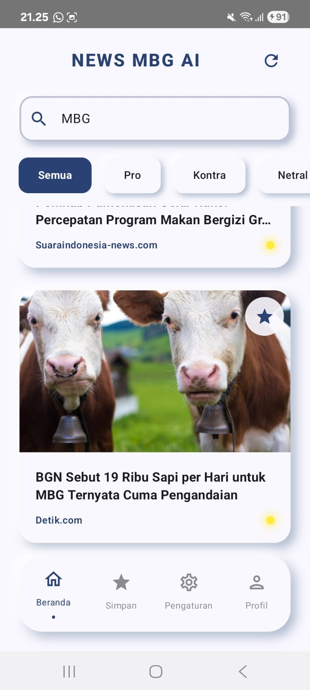
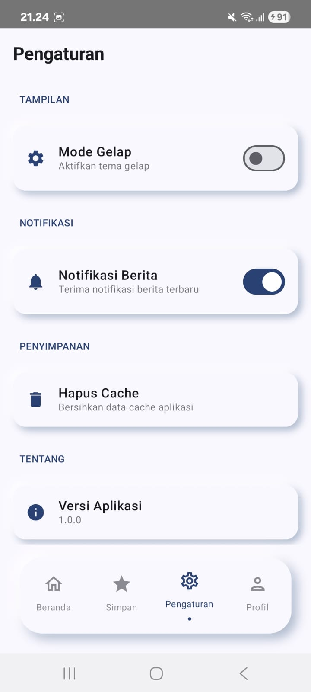

# News MBG - Premium Android News App with Gemini AI

[](https://github.com/Febvn/Proyek-Pengembangan-Aplikasi-Mobile/actions/workflows/android.yml)
[](https://kotlinlang.org/)
[](https://developer.android.com/jetpack/compose)
[](https://insert-koin.io/)
[](https://ktor.io/)
[](https://cashapp.github.io/sqldelight/)
[](https://aistudio.google.com/)

**News MBG** (Mbgnews) is a modern Android news portal application implementing **Clean Architecture** and Kotlin Multiplatform (KMP) base structure, wrapped in a premium **Neumorphism** user interface, and powered by **Google Gemini AI** for real-time news sentiment analysis and automated categorization.

This project was developed to fulfill the assignments for the **Mobile Application Development (PAM)** course at the Informatics Engineering Program, Institut Teknologi Sumatera (ITERA).

---

## 📱 App Screenshots

### Tampilan Awal - Home Screen


**Home Screen** menampilkan daftar berita dengan fitur:
- Real-time search dengan debounce
- Filter kategori berita (Semua, Pro, Kontra, Netral)
- Pull-to-refresh untuk memuat berita terbaru
- Bookmark artikel langsung dari card
- AI sentiment indicator dengan glowing shadow

### Pencarian - Search Feature


**Search Feature** memungkinkan pengguna:
- Mencari berita secara real-time
- Debounce 500ms untuk optimasi performa
- Hasil pencarian langsung ditampilkan
- Mendukung pencarian berdasarkan judul dan deskripsi

### Berita Tersimpan - Bookmark Screen


**Bookmark Screen** untuk menyimpan artikel favorit:
- Daftar artikel yang disimpan
- Hapus bookmark dengan satu klik
- Navigasi ke detail artikel
- Empty state yang informatif

### Pengaturan - Settings Screen


**Settings Screen** dengan berbagai opsi:
- Toggle mode gelap (UI ready)
- Toggle notifikasi
- Hapus cache aplikasi
- Informasi versi aplikasi

### Sentiment Analysis - Kontra Category


**AI-Powered Categorization** menunjukkan:
- Berita dengan sentiment "Kontra"
- Glowing indicator merah untuk identifikasi visual
- Filter berdasarkan kategori (Pro/Kontra/Netral)
- Gemini AI real-time analysis

---

## Key Features

1. **Premium Neumorphic UI**: A visually stunning interface utilizing Custom Compose Modifiers to create a sense of depth.
2. **Smart Gemini AI Integration**:
    * **Glowing Sentiment Indicators**: Automated news sentiment analysis (Positive, Negative, Neutral) represented by dynamic glowing shadows on the Detail page.
    * **Smart Category Updates**: Contextual text-based classification of news articles into relevant categories.
3. **Search & Category Filtering**: Instant article search functionality and horizontal category filters (All, Business, Technology, Science, Health).
4. **Local Data Management (CRUD)**: Create, Read, Update, and Delete custom articles locally using SQLDelight.
5. **Clean Architecture & MVVM**: Strict separation of code layers (`data`, `domain`, `presentation`) ensuring high maintainability and testability.

---

## 🚀 Sprint 3: Advanced Features & Offline Support

Sprint 3 focuses on advanced features, offline support, and enhanced user experience.

| Component | Weight | Criteria | Status | Details |
| :--- | :---: | :--- | :---: | :--- |
| **Search/Filter** | 25% | Working search, responsive, good UX | **COMPLETED** | Real-time search with 500ms debounce, category filtering (Semua/Pro/Kontra/Netral) |
| **API/Enhanced Local** | 25% | Proper integration, error handling | **COMPLETED** | Offline-first caching with Room, automatic cache on API success, graceful fallback |
| **Offline Support** | 20% | App usable offline, graceful degradation | **COMPLETED** | Cached articles load automatically, works completely offline, clear error messages |
| **Additional Screen** | 15% | Settings/Profile functional | **COMPLETED** | Complete Settings UI with dark mode toggle, notifications, cache management |
| **Bonus Features** | 15% | At least 1 bonus implemented | **ACHIEVED** | Pull-to-refresh, Share functionality, Enhanced bookmarks, Smooth animations, 4-tab navigation |

### ✅ Sprint 3 Features Implemented:

#### 1. Search & Filter Functionality
- ✅ Real-time search with 500ms debounce
- ✅ Category filtering (Semua, Pro, Kontra, Netral)
- ✅ Responsive UI with neumorphic design
- ✅ Smooth animations and transitions

#### 2. Offline Support
- ✅ Offline-first caching with Room Database
- ✅ Automatic cache on API success
- ✅ Graceful fallback to cached data when offline
- ✅ Cache management in Settings

#### 3. Settings Screen
- ✅ Dark mode toggle UI
- ✅ Notifications toggle
- ✅ Cache management with confirmation dialog
- ✅ App version and license information

#### 4. Enhanced Bookmark System
- ✅ Bookmark button on each article card
- ✅ Fully functional Bookmark screen
- ✅ Delete functionality
- ✅ Real-time state updates
- ✅ Empty state UI

#### 5. Bonus Features
- ✅ **Pull-to-Refresh**: Swipe down to refresh on Home screen
- ✅ **Share Functionality**: Share article URLs via Android share sheet
- ✅ **Enhanced Bookmark Indicators**: Visual feedback on article cards
- ✅ **Smooth Animations**: Shimmer loading and transitions
- ✅ **4-Tab Navigation**: Home, Bookmark, Settings, About

---

## Sprint 1: Foundation and AI Integration

The focus of Sprint 1 was establishing the project foundation, architectural patterns, and integrating the core external APIs.

| Component | Weight | Criteria | Status | Details |
| :--- | :---: | :--- | :---: | :--- |
| **Repository Setup** | 20% | Standardized group branch naming, active collaborators. | **COMPLETED** | Upstream branch utilizes the official format: `project/123140034-123140131-Mbgnews`. |
| **Project Structure** | 25% | Clean Architecture implemented, successful builds. | **COMPLETED** | 3-layer architecture implemented across the `composeApp` module (`data`, `domain`, `presentation`). |
| **CI/CD Pipeline** | 20% | GitHub Actions integration, status badge displayed. | **COMPLETED** | Workflow configuration `android.yml` added; badge active in README. |
| **Documentation** | 25% | Comprehensive README and Project Plan. | **COMPLETED** | Documentation tailored for News MBG, with detailed plans in `PROJECT_PLAN.md`. |
| **Team Collaboration** | 10% | Balanced contributions verified via Git history. | **COMPLETED** | Both team members show clear commit histories. |
| **Bonus (Koin DI)** | +10% | Dependency Injection setup using Koin. | **ACHIEVED** | Koin DI fully configured in `di/AppModule.kt`. |

---

## Sprint 2: UI Implementation and Data Persistence

The focus of Sprint 2 shifted towards the presentation layer, complex navigation, state management, and robust local data persistence operations.

| Component | Weight | Criteria | Status | Details |
| :--- | :---: | :--- | :---: | :--- |
| **UI Screens** | 25% | Minimum 3 working screens, proper layouts, Material 3. | **COMPLETED** | Implemented `HomeScreen`, `DetailScreen`, `BookmarkScreen` (List), and `AddEditScreen` using Scaffold and Material 3 components. |
| **Navigation** | 20% | Working navigation, argument passing, back handling. | **COMPLETED** | Type-safe argument passing (`url`) for Detail and Add/Edit routes via `NavGraph`. Fully handles `popBackStack()`. |
| **Data Layer** | 25% | Repository pattern, local storage, proper architecture. | **COMPLETED** | Implemented `NewsRepository` interfaces and `SQLDelight` queries (`Article.sq`) for robust local caching. |
| **CRUD Operations** | 20% | Create, Read, Update, Delete functionality working. | **COMPLETED** | Full CRUD capabilities integrated into the `BookmarkScreen` and `AddEditScreen`. |
| **Code Quality** | 10% | Clean code, proper Feature-based structure, CI passing. | **COMPLETED** | Refactored presentation layer into Feature-Based directory structure (`screens/home/`, `screens/detail/`, etc.). |
| **Bonus (API Integration)** | +10% | External API integration. | **ACHIEVED** | Continued integration and data fetching from Ktor NewsApi. |

---

## Development Team

| Full Name | Student ID (NIM) | Primary Role |
| :--- | :---: | :--- |
| **Febrian Valentino Nugroho** | `123140034` | Lead Developer, UI/UX Designer, Gemini AI & Koin DI Integration |
| **Jonathan Pande Sinaga** | `123140153` | Database Engineer, Local Caching (SQLDelight) & Repository Implementation |

---

## Project Structure (`composeApp/`)

The application is logically grouped adhering to Clean Architecture principles, specifically optimized for Kotlin Multiplatform (KMP) and Feature-Based UI structure:

```text
composeApp/src/commonMain/kotlin/com/itera/news/
├── data/                         # DATA LAYER (Data source, networking, DB)
│   ├── local/                    # SQLDelight Database generated interfaces
│   ├── remote/                   # Ktor REST API & Gemini AI Service
│   │   ├── api/
│   │   └── dto/
│   └── repository/               # Repository implementations (Offline-first caching)
│       └── NewsRepositoryImpl.kt
│
├── domain/                       # DOMAIN LAYER (Business logic, pure Kotlin)
│   ├── model/                    # Domain Data Models (Article)
│   ├── repository/               # Repository Interfaces
│   └── usecase/                  # Use cases encapsulating business logic
│
├── presentation/                 # PRESENTATION LAYER (UI & State)
│   ├── navigation/               # Routing and Type-safe Navigation setup
│   │   ├── NavGraph.kt
│   │   └── Screen.kt
│   └── screens/                  # FEATURE-BASED UI Screens and ViewModels
│       ├── home/                 # HomeScreen, HomeViewModel, HomeUiState
│       ├── detail/               # DetailScreen
│       ├── add/                  # AddEditScreen, AddEditViewModel, AddEditUiState
│       ├── bookmark/             # BookmarkScreen, BookmarkViewModel, BookmarkUiState
│       └── shared/               # Shared UI Components
│
├── core/                         # CORE PLATFORM LOGIC
│   ├── di/                       # Dependency Injection Layer (AppModule.kt)
│   ├── network/                  # HttpClient configuration
│   └── util/                     # Platform-specific database drivers
│
├── ui/                           # UI THEMING LAYER
│   └── theme/                    # Material3 Theme & Custom Neumorphic shadow modifiers
│
└── App.kt                        # Primary Composable Entrypoint
```

---

## Installation and Setup

1. **Clone the Repository**:
   ```bash
   git clone https://github.com/Febvn/Proyek-Pengembangan-Aplikasi-Mobile.git
   cd Proyek-Pengembangan-Aplikasi-Mobile
   ```

2. **Create local.properties**:
   Duplicate the `local.properties.example` template to `local.properties` in the root directory:
   ```bash
   cp local.properties.example local.properties
   ```

3. **Configure Gemini API Key**:
   Open `local.properties` and insert your Gemini API Key:
   ```properties
   GEMINI_API_KEY=AIzaSy...
   ```
   *Note: Free API Keys can be acquired from Google AI Studio.*

4. **Open in Android Studio**:
   * Ensure you are using Android Studio Ladybug (2024.2.1) or newer.
   * Allow the project to complete the Gradle Sync process.

5. **Build and Run**:
   * Select the `app` or `composeApp` run configuration.
   * Execute the application on an active emulator or physical device.

---

## Related Documentation

* [Comprehensive Run Guide](./docs/CARA_MENJALANKAN.md)
* [Project Plan & Sprints](./docs/PROJECT_PLAN.md)
* [Architecture & Code Explanation](./docs/STRUKTUR_KODE.md)
* [Git Branching & Workflows](./docs/GIT_WORKFLOW.md)
* [Troubleshooting Guide](./docs/TROUBLESHOOTING.md)

---

## Instructor
* Bapak Habib (GitHub: mh4Scripts)

**Informatics Engineering Program**
Institut Teknologi Sumatera (ITERA)
